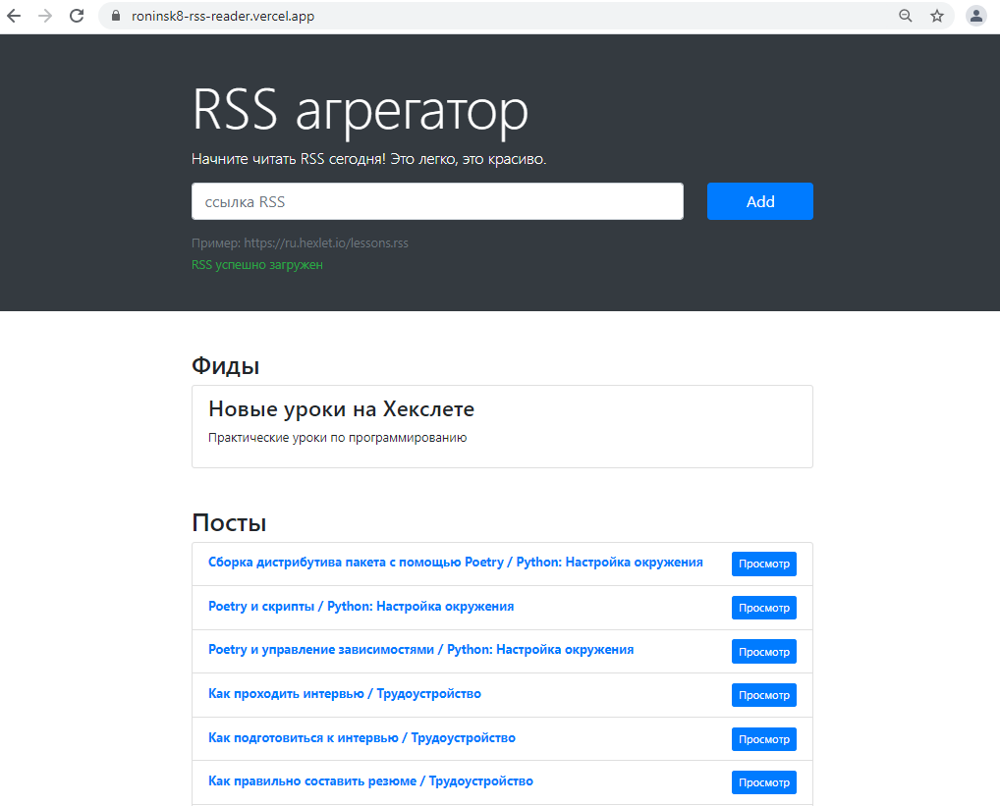

<h1 align="center">
   
  RSS агрегатор
   
</h1>

<h3 align="center"></a>RSS агрегатор с автоматическим обновлением фидов и предпросмотром постов</h3>

Hexlet tests and linter status:

  
  

### [Ссылка на проект](https://roninsk8-rss-reader.vercel.app/)

## В проекте используется:
* Webpack
* Bootstrap
* Подключение текстов [i18next](https://vercel.com/)
* Валидация [yup](https://github.com/jquense/yup)
* http-запросы [Axios](https://github.com/axios/axios)
* [CodeClimate](https://codeclimate.com/)
* Деплой на [Vercel](https://vercel.com/)

##### RSS ленты для тестов:
* https://ru.hexlet.io/lessons.rss
* https://opensource.com/feed
* Лента для тестов, обновляется каждые 10 сек 
  - http://lorem-rss.herokuapp.com/feed?unit=second&interval=10